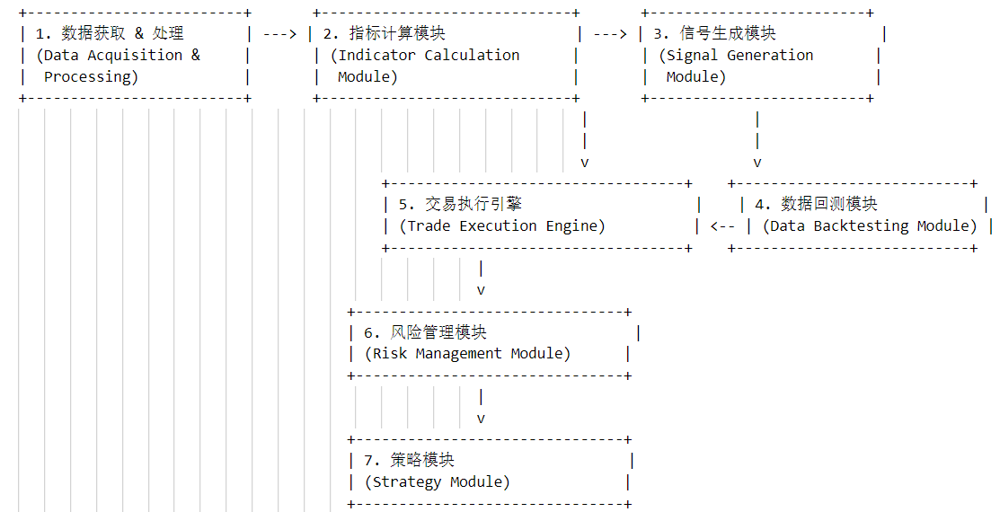

# CryptoTrader

CryptoTrader is an automated trading system designed to interface seamlessly with various cryptocurrency exchanges. The system integrates several modules, each responsible for specific aspects of the trading process, from data acquisition to risk management.

## System Architecture

CryptoTrader's workflow consists of the following key modules:

1. **数据获取 & 处理 (Data Acquisition & Processing)**:
   - **Function**: Responsible for fetching and preprocessing market data to be used across all other modules.
   - **Input**: Real-time data from cryptocurrency exchanges.
   - **Output**: Cleaned and normalized data ready for analysis.

2. **指标计算模块 (Indicator Calculation Module)**:
   - **Function**: Computes various trading indicators (e.g., SMA, EMA, RSI) used to assess market conditions.
   - **Input**: Processed data from the Data Acquisition module.
   - **Output**: Indicator values that feed into the Signal Generation module.

3. **信号生成模块 (Signal Generation Module)**:
   - **Function**: Analyzes indicators to generate trading signals.
   - **Input**: Indicators from the Calculation module.
   - **Output**: Buy or sell signals.

4. **数据回测模块 (Data Backtesting Module)**:
   - **Function**: Tests trading strategies using historical data to simulate performance and refine signals.
   - **Input**: Trading signals.
   - **Output**: Performance metrics and strategy refinement.

5. **交易执行引擎 (Trade Execution Engine)**:
   - **Function**: Executes trades on the exchange based on signals received, considering current market conditions.
   - **Input**: Confirmed signals from the Signal Generation or Backtesting Module.
   - **Output**: Executed trades.

6. **风险管理模块 (Risk Management Module)**:
   - **Function**: Continuously monitors and manages the risk associated with open positions and market conditions.
   - **Input**: Ongoing market data and active trade information.
   - **Output**: Risk assessment and management actions.

## Getting Started

### Prerequisites

Ensure you have the following installed:
- Python 3.8 or higher
- pip (Python package installer)

### Installation

1. Clone the repository:
   ```bash
   git clone https://github.com/HustWolfzzb/CryptoTrader.git
   ```

2. Navigate to the cloned repository:
   ```bash
   cd CryptoTrader
   ```

3. Install required Python packages:
   ```bash
   pip install -r requirements.txt
   ```

---

To extend the `README.md` with instructions on how to generate access keys, secret keys, and configure IP binding for running your trading system, you can add a section like this after the installation and requirements setup:

---

## Configuration

### Generating Access and Secret Keys

To securely interact with cryptocurrency exchanges, you will need to generate access keys and secret keys. These keys are essential for authentication and authorization processes. Here's how to set them up:

1. **Login to Your Exchange Platform**:
   - Navigate to the exchange website (e.g., OKX, Binance).
   - Log into your account.

2. **Access API Management**:
   - Find the API section in the user dashboard or under account settings.
   - Click on “Create API” or “Manage API”.

3. **Create New API Key**:
   - Enter a label for your API key (something that helps you identify the key's purpose).
   - Set permissions based on the operations you want the bot to perform (e.g., read, trade). Avoid enabling withdrawal permissions for security reasons.
   - If required, set IP restrictions to enhance security. This limits API key usage to designated IP addresses.

4. **Note Down the API Key and Secret**:
   - Once the API key is generated, ensure you copy and store both the API Key and the Secret Key securely. **Do not share these keys with anyone.**

### Binding IP Address (If Applicable)

Some API setups allow or require you to bind an IP address to the API key to further secure the connection. Here’s how you can do it:

1. **Determine Your External IP Address**:
   - You can find out your external IP address by visiting [http://whatismyipaddress.com](http://whatismyipaddress.com) or a similar service.

2. **Bind the IP Address in the Exchange’s API Settings**:
   - Return to the API settings on the exchange where you created the API key.
   - Enter your IP address in the designated field for IP restrictions.

### Configuring the Trading Bot

After obtaining your keys and setting up IP restrictions, you need to configure your trading bot:

1. **Edit the Configuration File**:
   - Navigate to the `Config.py` file in your project directory.
   - Safely enter your API key and Secret Key into the appropriate variables.

2. **Ensure Network Accessibility**:
   - If you are running your bot on a server, make sure that the server's IP address is the one bound to the API key.
   - Check that your firewall settings allow outgoing connections to the exchange APIs.


## Running the System

CryptoTrader consists of multiple modules, each implemented as a separate Python script. Below are the steps to run the key components of the system:

### Data Handling and Indicator Calculation

1. **DataHandler.py**: This script is responsible for fetching and processing the raw market data.
   ```bash
   python DataHandler.py
   ```

2. **IndicatorCalculator.py**: After processing the data, run this script to calculate various trading indicators.
   ```bash
   python IndicatorCalculator.py
   ```

### Signal Generation and Execution

3. **SignalGenerator.py**: Generates trading signals based on the indicators calculated previously.
   ```bash
   python SignalGenerator.py
   ```

4. **ExecutionEngine.py**: Executes trades based on the signals generated by the SignalGenerator.
   ```bash
   python ExecutionEngine.py
   ```

### Backtesting

5. **BacktestingSystem.py**: To verify the efficacy of your trading strategies using historical data, run the backtesting system.
   ```bash
   python BacktestingSystem.py
   ```

### Monitoring

6. **SystemMonitor.py**: This script can be used to monitor the system’s performance and health.
   ```bash
   python SystemMonitor.py
   ```

### Configuration

Make sure to review and configure `Config.py` appropriately before running the scripts to ensure all modules interact correctly with each other and the target trading platform.

```bash
# Edit Config.py to suit your trading configuration
nano Config.py
```

### Log Files

Logs from the executions can be reviewed in the generated log files, such as `okex_execution_engine.log`, to analyze the trade executions and system behavior.

### Note
Ensure you have set up all necessary API keys and other configurations as required in `Config.py`. These scripts are interdependent, and their successful execution relies on the proper setup of environment variables and configurations.


---

## Contributing

Contributions to CryptoTrader are welcome! Please read through our contributing guidelines to learn about our review process, coding conventions, and more.

## License

Distributed under the MIT License. See LICENSE for more information.
